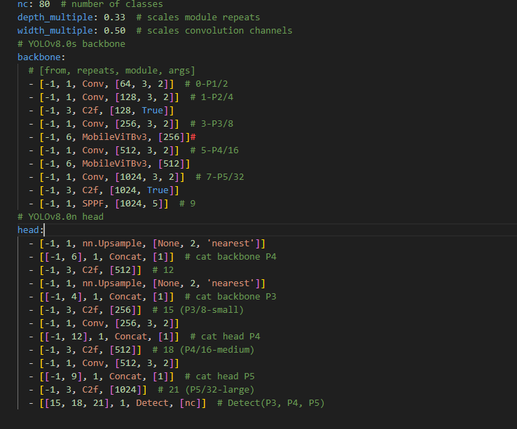
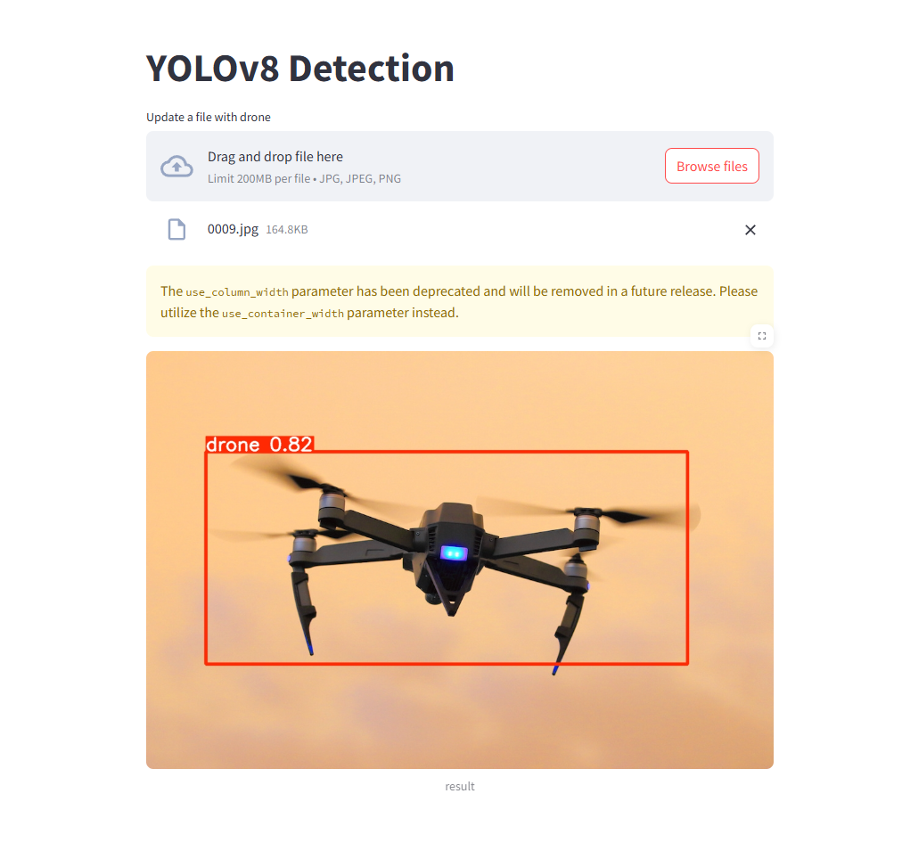

# YOLOv8 + MobileViTv3

## Author
**YuTong Li (Harry)**

## Requirements
- 12GB NVIDIA GPU  
- Python **3.9.0**  
- PyTorch **v1.12 or later**
> **Note**: `app.py` is the Streamlit launcher.  
> Before running, please make sure you have saved the trained model in the current directory.
## About MobileViTv3
MobileViTv3 is introduced in the paper:  
**[MobileViTv3: Mobile-Friendly Vision Transformer with Simple and Effective Fusion of Local, Global and Input Features](https://arxiv.org/abs/2209.15159)**  
*by Shakti N. Wadekar and Abhishek Chaurasia*

### Backbone

## Contribution of This Project
This project verifies the effectiveness of incorporating **MobileViTv3** into **YOLOv8**:  
- Results are better than the original `yolov8n.pt`  
- Training curves are smoother  

## Results

### Training and Validation Loss Curves (YOLOv8 + MobileViT)

### Training and Validation Loss Curves (YOLOv8)

## Streamlit Demo Sample

